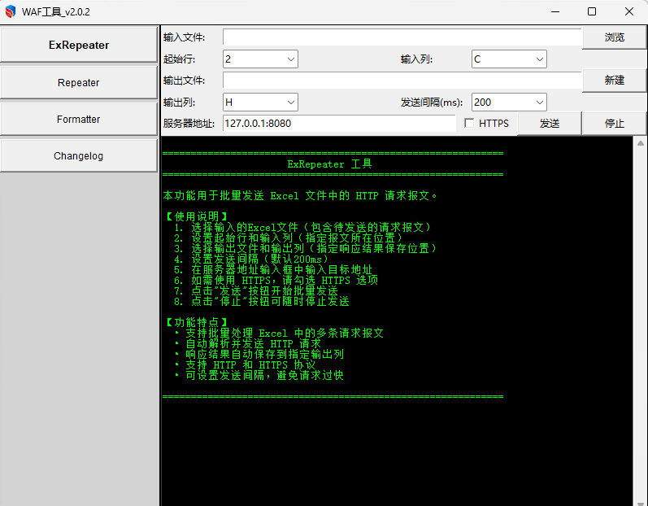

# WAF工具

`WAF工具` 是一个支持图形界面的 HTTP 请求发送工具，支持发送单条报文、批量发送以及报文格式化处理。主要用于测试服务器响应情况和 WAF 防护效果。

## 功能模块

### 1. ExRepeater - 批量请求发送
从 Excel 文件中读取多条 HTTP 请求报文，批量发送到指定服务器，并将响应结果自动写回 Excel 文件。

### 2. Repeater - 单条请求发送
手动输入 HTTP 请求报文，发送到指定服务器并查看响应结果。

### 3. Formatter - 报文格式化
处理 Excel 文件中的报文，去除多余空行，让报文更加整洁规范。

### 4. Changelog - 更新日志
查看软件的版本更新历史。

## 图形化界面预览




## 打包工具使用

本项目使用 `build.py` 脚本进行打包，打包后的可执行文件会自动包含版本号。

### 前置条件

需要安装 Python 和 pyinstaller：

```shell
pip install pyinstaller
```

### 打包步骤

1. 确保项目结构完整，包含以下必要文件：
   - `main.py` - 程序入口
   - `static/version.txt` - 版本号文件
   - `static/favicon_256x256.ico` - 应用图标

2. 运行打包脚本：

```shell
py build.py
```

### 打包输出

打包完成后，可执行文件位于 `dist/` 目录下，文件名格式为 `WAF工具_{版本号}.exe`，例如：
- `dist/WAF工具_2.0.260615.exe`

### 版本号管理

版本号存储在 `static/version.txt` 文件中，修改该文件后重新打包，生成的可执行文件名称会自动更新。

### 打包参数说明

| 参数 | 说明 |
|------|------|
| `--onefile` | 打包为单个可执行文件 |
| `--windowed` | 无控制台窗口（GUI 应用） |
| `--icon` | 指定应用图标 |
| `--add-data=static;static` | 包含静态资源目录 |

